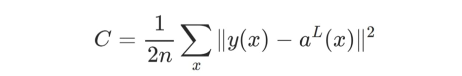
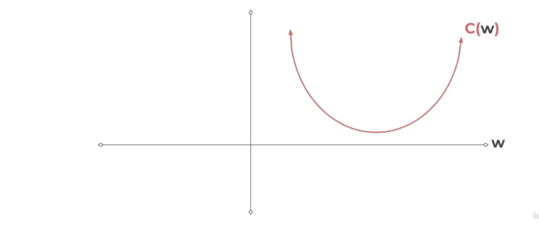
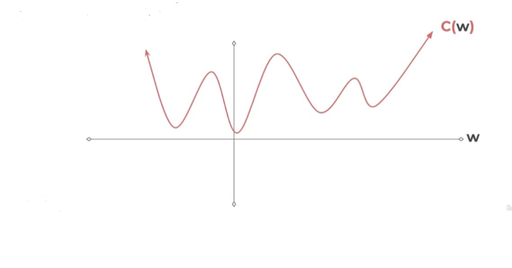
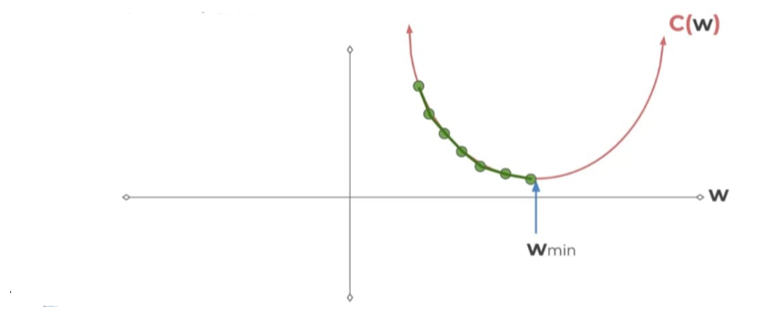
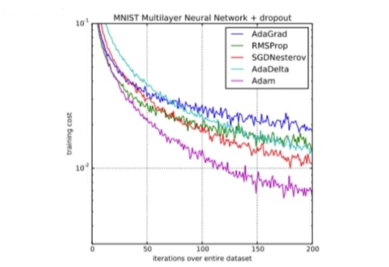

# Konsep Dasar Deep Learning: Cost Function dan Optimization

Catatan ini akan menjelaskan beberapa konsep fundamental dalam Deep Learning, termasuk arsitektur jaringan saraf, berbagai jenis fungsi biaya (cost functions), dan algoritma optimasi yang digunakan untuk melatih model.

## 1. Fungsi Biaya (Cost Function)

Fungsi biaya (sering juga disebut fungsi kerugian atau *loss function*) mengukur seberapa baik (atau buruk) kinerja model kita dalam memprediksi output yang benar. Tujuan utama saat melatih jaringan saraf adalah **meminimalkan** nilai fungsi biaya ini.

### Bentuk Umum Fungsi Biaya
Secara umum, fungsi biaya $C$ dapat dilihat sebagai fungsi dari bobot ($W$), bias ($B$), input pelatihan ($S^r$), dan output yang diinginkan ($E^r$).

$$C(W, B, S^r, E^r)$$

### Fungsi Biaya Kuadratik (Quadratic Cost / Mean Squared Error)

Ini adalah salah satu fungsi biaya yang paling umum, terutama untuk masalah regresi.

Untuk satu sampel pelatihan, fungsi biaya kuadratik sering kali ditulis sebagai:
$$C = \frac{1}{2} \|y(x) - a^L(x)\|^2$$
Dimana:
* $C$: Nilai fungsi biaya.
* $y(x)$: Output yang diinginkan (label benar) untuk input $x$.
* $a^L(x)$: Output aktual dari jaringan saraf (aktivasi dari lapisan terakhir $L$) untuk input $x$.
* $\| \cdot \|^2$: Menunjukkan kuadrat dari norma (biasanya norma Euclidean), yang berarti jumlah kuadrat perbedaan antara output yang diinginkan dan output aktual. Faktor $1/2$ sering ditambahkan untuk menyederhanakan perhitungan turunan.

Ketika berhadapan dengan **batch** (sekumpulan) data pelatihan, notasi ini diperluas:

$$C = \frac{1}{2n} \sum_x \|y(x) - a^L(x)\|^2$$
Dimana:
* $n$: Jumlah sampel dalam batch pelatihan.
* $\sum_x$: Penjumlahan di atas semua sampel pelatihan $x$ dalam batch.

Tujuan kita adalah menemukan nilai $W$ (dan $B$) yang membuat $C$ sekecil mungkin.

### Kompleksitas Fungsi Biaya
Meskipun fungsi biaya kuadratik terlihat sederhana dalam satu dimensi, dalam praktiknya, fungsi biaya dari jaringan saraf yang kompleks memiliki banyak parameter dan permukaan yang sangat tidak linier.

Fungsi biaya sebenarnya akan sangat kompleks, dengan banyak lembah lokal (local minima) dan titik pelana (saddle points), bukan hanya satu lembah parabola sederhana. Ini membuat proses menemukan minimum global menjadi tantangan.

### Fungsi Biaya Cross-Entropy

Cross-Entropy adalah fungsi biaya yang sering digunakan untuk masalah klasifikasi, terutama ketika output model adalah probabilitas. Ini lebih disukai daripada *quadratic cost* untuk klasifikasi karena membantu mengatasi masalah "pelambatan" pembelajaran yang dapat terjadi dengan *quadratic cost* ketika output neuron sangat dekat dengan 0 atau 1.

**Untuk Klasifikasi Biner (2 Kelas):**

$$-\left( y \log(p) + (1-y) \log(1-p) \right)$$
Dimana:
* $y$: Label sebenarnya (0 atau 1).
* $p$: Probabilitas yang diprediksi oleh model bahwa sampel tersebut termasuk dalam kelas 1.

**Untuk M Jumlah Kelas (> 2 / Multiclass Classification):**

$$-\sum_{c=1}^{M} y_{o,c} \log(p_{o,c})$$
Dimana:
* $M$: Jumlah total kelas.
* $y_{o,c}$: Variabel biner (0 atau 1) yang menunjukkan apakah observasi $o$ termasuk dalam kelas $c$.
* $p_{o,c}$: Probabilitas yang diprediksi oleh model bahwa observasi $o$ termasuk dalam kelas $c$.

Tujuan dari Cross-Entropy adalah untuk memaksimalkan kecocokan antara distribusi probabilitas yang diprediksi oleh model dan distribusi probabilitas yang sebenarnya (ground truth). Semakin kecil nilai Cross-Entropy, semakin baik model memprediksi.

## 2. Gradient Descent

Gradient Descent adalah algoritma optimasi iteratif yang digunakan untuk menemukan nilai minimum dari fungsi biaya. Ini bekerja dengan mengambil langkah-langkah berulang di arah yang berlawanan dari gradien (turunan) fungsi pada titik saat ini. Gradien menunjukkan arah peningkatan terbesar, jadi bergerak berlawanan arah gradien akan membawa kita menuju minimum.

### Cara Kerja Gradient Descent:
1.  **Inisialisasi:** Mulai dengan nilai bobot ($W$) dan bias ($B$) secara acak.
2.  **Hitung Gradien:** Hitung gradien (turunan parsial) dari fungsi biaya $C$ terhadap setiap bobot dan bias. Gradien ini menunjukkan kemiringan permukaan biaya di titik saat ini.
3.  **Perbarui Parameter:** Sesuaikan bobot dan bias dengan bergerak berlawanan arah gradien. Langkah pembaruan diatur oleh *learning rate* ($\alpha$).
    * Untuk Bobot: $$W_{baru} = W_{lama} - \alpha \frac{\partial C}{\partial W_{lama}}$$
    * Untuk Bias: $$B_{baru} = B_{lama} - \alpha \frac{\partial C}{\partial B_{lama}}$$
4.  **Ulangi:** Ulangi langkah 2 dan 3 sampai fungsi biaya mencapai nilai minimum atau kriteria penghentian terpenuhi (misalnya, jumlah iterasi maksimum atau perubahan biaya sangat kecil).

### Ukuran Langkah (Learning Rate)
Ukuran langkah (sering disebut *learning rate*) adalah hiperparameter krusial.

* **Langkah Kecil:** "Smaller step sizes take longer to find the minimum."
    * Jika *learning rate* terlalu kecil, konvergensi akan sangat lambat, membutuhkan banyak iterasi untuk mencapai minimum.
* **Langkah Besar:** Jika *learning rate* terlalu besar, algoritma mungkin akan "melompat" melewati minimum, atau bahkan menyimpang dan gagal menemukan minimum sama sekali.

## 3. Adam Optimizer (Adaptive Moment Estimation)

Adam adalah salah satu algoritma optimasi *gradient descent* yang paling populer dan efektif saat ini. Ini adalah metode adaptif yang menghitung *learning rate* adaptif untuk setiap parameter (bobot dan bias) secara individual.

### Keunggulan Adam dibandingkan Algoritma Gradient Descent Lainnya:

Grafik di atas menunjukkan kinerja Adam (garis ungu) dibandingkan dengan algoritma optimasi lainnya (AdaGrad, RMSProp, SGD Nesterov, AdaDelta) dalam mengurangi *training cost* pada dataset MNIST. Terlihat jelas bahwa Adam mencapai *cost* yang lebih rendah dengan lebih cepat (lebih sedikit iterasi).

### Bagaimana Adam Bekerja:
Adam menggabungkan ide-ide dari dua algoritma optimasi populer lainnya:
1.  **Momentum:** Menggunakan rata-rata bergerak dari gradien untuk mempercepat konvergensi di arah yang relevan dan mengurangi osilasi.
2.  **RMSProp (Root Mean Square Propagation):** Menggunakan rata-rata bergerak dari kuadrat gradien untuk menyesuaikan *learning rate* untuk setiap parameter. Ini membantu dalam menangani fitur-fitur yang memiliki gradien yang jarang atau tidak konsisten.

Secara sederhana, Adam:
* **Menghitung rata-rata bergerak dari gradien (momen pertama):** Mirip dengan momentum.
* **Menghitung rata-rata bergerak dari kuadrat gradien (momen kedua):** Mirip dengan RMSProp.
* **Melakukan koreksi bias:** Mengkompensasi fakta bahwa rata-rata bergerak ini diinisialisasi sebagai nol.
* **Memperbarui parameter:** Menggunakan momen pertama dan kedua yang terkoreksi untuk menghitung *step size* yang adaptif untuk setiap parameter.

Dengan menggabungkan keuntungan dari Momentum dan RMSProp, Adam mampu:
* **Konvergensi Cepat:** Mencapai minimum lebih cepat.
* **Stabilitas:** Lebih stabil dalam menghadapi gradien yang bising atau jarang.
* **Performa Unggul:** Seringkali memberikan hasil yang sangat baik di berbagai tugas *deep learning*.

