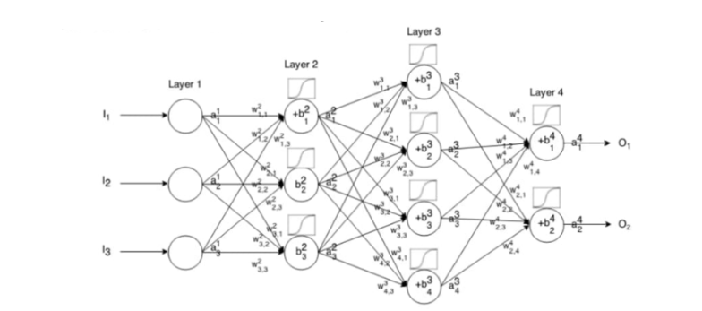

# Konsep Neural Network

## 1. Arsitektur Jaringan Saraf (Neural Network) dan Parameter

Sebuah jaringan saraf tiruan (Artificial Neural Network/ANN) terdiri dari lapisan-lapisan neuron yang saling terhubung. Setiap koneksi antar neuron memiliki bobot (weight) dan setiap neuron memiliki bias. Proses ini memungkinkan jaringan untuk mempelajari pola dari data.

### Struktur Jaringan dan Parameter
Mari kita lihat contoh jaringan saraf kecil dengan semua parameternya diberi label:

Dalam ilustrasi ini:
* **$I_1, I_2, I_3$**: Adalah input ke lapisan pertama (Layer 1).
* **$w_{j,k}^l$**: Merujuk pada **bobot (weight)** yang menghubungkan neuron ke $k$ di lapisan pertama ke neuron ke $j$ di lapisan $l$. Misalnya, $w_{1,1}^2$ adalah bobot dari input $I_1$ ke neuron pertama di Layer 2.
* **$b_j^l$**: Merujuk pada **bias** untuk neuron ke $j$ di lapisan $l$. Misalnya, $b_1^2$ adalah bias untuk neuron pertama di Layer 2.
* **$a_j^l$**: Merujuk pada **aktivasi** (output) dari neuron ke $j$ di lapisan $l$ setelah melalui fungsi aktivasi.
* **$O_1, O_2$**: Adalah output akhir dari jaringan (Layer 4).
  
Setiap neuron di lapisan tersembunyi menghitung outputnya (aktivasi) dengan menjumlahkan hasil perkalian input dari lapisan sebelumnya dengan bobotnya masing-masing, ditambah bias, kemudian menerapkan fungsi aktivasi.

**Ringkasan Parameter:**
* **W (Weights / Bobot):** Matriks bobot yang menentukan kekuatan koneksi antar neuron.
* **B (Biases / Bias):** Vektor bias yang ditambahkan ke input yang dibobotkan, memungkinkan neuron untuk mengaktifkan dirinya bahkan ketika semua inputnya nol.

Kurang lebih *alur kerja* ANN (Artificial Neural Network) memang seperti itu, tapi urutannya bisa dijelaskan lebih rapi seperti berikut supaya lebih mudah dipahami:

---

## **Cara Kerja ANN**

### **1. Forward Propagation**

* Input dimasukkan ke jaringan.
* Tiap neuron melakukan operasi:
 
**$z = w \cdot x + b$**
 
* Lalu diaktifkan dengan activation function (ReLU, sigmoid, dsb).
* Hasil akhir keluar sebagai nilai prediksi (*output model*).

---

### **2. Hitung Loss Function**

* Bandingkan output model dengan *label asli*.
* Hitung error menggunakan fungsi loss, misal:

  * MSE (regresi)
  * Cross-entropy (klasifikasi)
* Loss ini menunjukkan seberapa salah prediksi.

---

### **3. Backpropagation**

* Hitung *gradien* dari loss terhadap bobot.
* Intinya: cari bobot mana yang membuat prediksi salah dan sejauh apa salahnya.
* Gradien mengalir *mundur* layer demi layer (dari output → hidden → input).

---

### **4. Optimization / Update Parameters**

* Optimizer (SGD, Adam, RMSProp, dll) memperbarui bobot menggunakan gradien:
 
**$$w = w - \eta \cdot \frac{\partial L}{\partial w}$$**
 
* Tujuannya: mengurangi error setiap iterasi.

---
### **Forward Prop → Hitung Loss → Backprop → Optimizer Update**

Proses ini disebut **training loop**, dan berulang ribuan kali sampai model konvergen.

