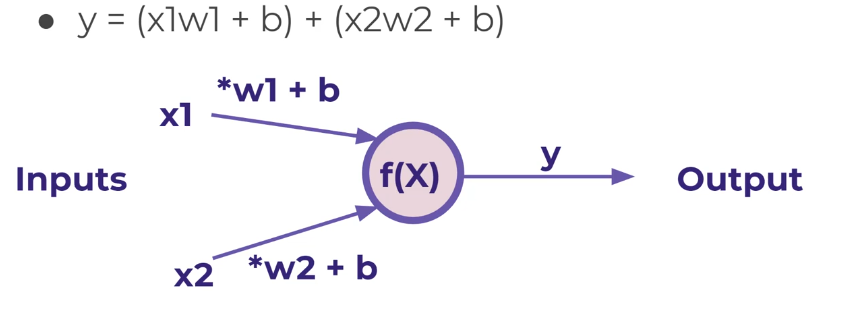

Proyek ini berisi implementasi dasar dari model Perceptron, unit komputasi paling sederhana dalam Jaringan Saraf Tiruan (Artificial Neural Network - ANN). Perceptron dirancang untuk melakukan klasifikasi biner, yaitu memisahkan data ke dalam dua kategori.

## Konsep Perceptron

Perceptron bekerja dengan mengambil sejumlah input, mengalikan setiap input dengan bobotnya masing-masing, menjumlahkan semua hasil perkalian tersebut bersama dengan nilai bias, dan kemudian melewati total ini melalui fungsi aktivasi untuk menghasilkan output akhir.

### Variabel Utama

Dalam konteks Perceptron, terdapat beberapa variabel kunci:

* **Input ($x_1, x_2, \ldots, x_n$):** Ini adalah fitur atau data masukan yang diberikan kepada model. Dalam proyek ini, Anda mungkin akan melihat contoh dengan dua input, $x_1$ dan $x_2$. **Nilai ini berasal langsung dari dataset Anda.**

* **Bobot (Weights) ($w_1, w_2, \ldots, w_n$):** Setiap input ($x_i$) memiliki bobot ($w_i$) yang sesuai. Bobot ini merepresentasikan **pentingnya atau kekuatan pengaruh** dari input tersebut terhadap keputusan akhir model.
    * **Asal Nilai Awal:** Pada awalnya (saat inisialisasi model), nilai bobot ini **dimulai secara acak** (random).
    * **Bagaimana Mereka Diperoleh (Dipelajari):** Selama proses pelatihan, nilai bobot ini **diperbarui secara iteratif dan matematis** berdasarkan seberapa besar kesalahan yang dibuat model dalam prediksinya. Proses penyesuaian ini bertujuan untuk mengurangi error.

* **Bias ($b$):** Bias adalah nilai konstan yang ditambahkan ke jumlah tertimbang dari input. Ini berfungsi sebagai **ambang batas (threshold) internal** yang memungkinkan model untuk menggeser garis pemisah keputusannya.
    * **Asal Nilai Awal:** Sama seperti bobot, nilai bias ini **dimulai secara acak** (random) pada inisialisasi.
    * **Bagaimana Mereka Diperoleh (Dipelajari):** Selama pelatihan, nilai bias ini juga **diperbarui secara iteratif dan matematis** bersama dengan bobot, dengan tujuan yang sama: mengurangi error prediksi.

* **Jumlah Tertimbang ($z$):** Ini adalah hasil penjumlahan semua perkalian input dengan bobotnya, ditambah bias.
    $$z = (x_1 \cdot w_1) + (x_2 \cdot w_2) + \ldots + (x_n \cdot w_n) + b$$

* **Fungsi Aktivasi ($f(z)$):** Sebuah fungsi non-linear yang diterapkan pada $z$ untuk menghasilkan output akhir. Untuk perceptron klasik, seringkali digunakan fungsi langkah (step function).
    $$y = f(z)$$

* **Output ($y$):** Ini adalah prediksi yang dihasilkan oleh Perceptron, biasanya berupa nilai biner (0 atau 1) untuk klasifikasi.

### Bagaimana Perceptron Belajar? (Proses Pelatihan)

Perceptron belajar melalui proses iteratif yang dikenal sebagai Perceptron Learning Rule. Proses ini melibatkan:

1.  **Inisialisasi Acak:** Bobot dan bias dimulai dengan nilai acak yang kecil.
2.  **Iterasi (Epoch):** Seluruh dataset pelatihan diproses berulang kali.
    * **Perhitungan Forward Pass:** Untuk setiap baris (sampel) data di dataset, inputnya ($x_1, x_2$, dst.) digunakan bersama dengan bobot dan bias saat ini untuk menghitung output ($y$). **Penting: Setiap baris data dihitung satu per satu, bukan ditotal per kolom.**
    * **Perhitungan Error:** Output yang diprediksi ($y$) dibandingkan dengan target sebenarnya ($t$) dari dataset. Error dihitung sebagai $Error = t - y$.
    * **Pembaruan Bobot & Bias:** Jika ada error, bobot dan bias disesuaikan sedikit demi sedikit menggunakan rumus:
        $$w_i^{\text{baru}} = w_i^{\text{lama}} + \alpha \cdot (t - y) \cdot x_i$$
        $$b^{\text{baru}} = b^{\text{lama}} + \alpha \cdot (t - y)$$
        Di mana $\alpha$ adalah **Learning Rate** (tingkat pembelajaran), parameter yang menentukan seberapa besar penyesuaian yang dilakukan.

Proses ini berulang sampai model dapat mengklasifikasikan semua data pelatihan dengan benar (konvergen) atau setelah jumlah iterasi maksimum tercapai.

